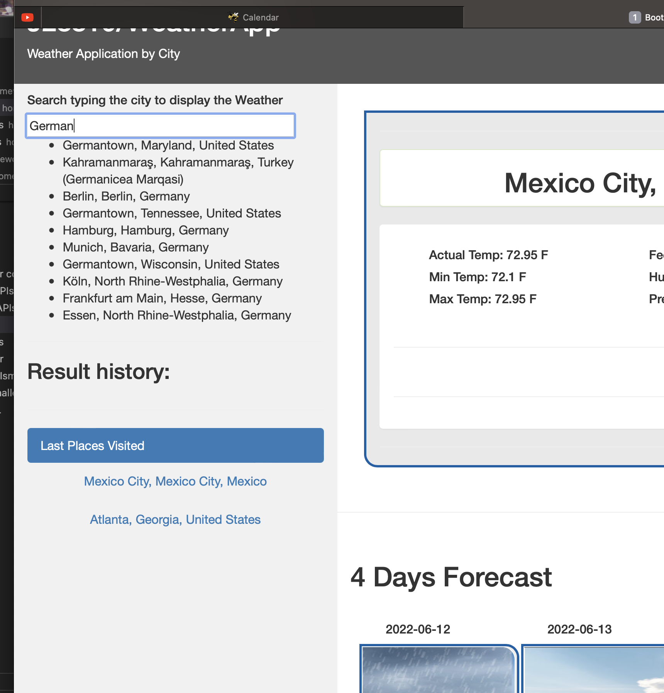
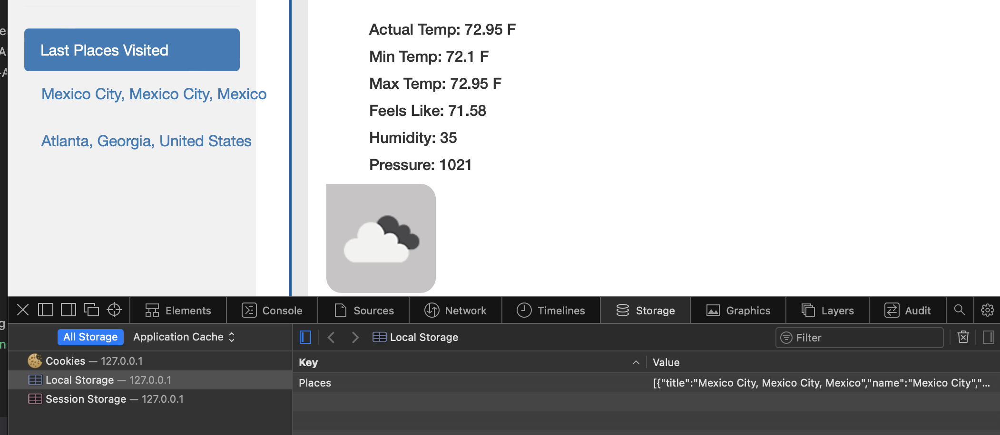

# 06WheaterApp
Wheatear Application 

## Locations 

Index.html -> Contain all the code that will be processes by the browser to display in the end user display assets -> contain all the formating code (CSS) and pictures that will be displayed in the front end, js where all the javascript code.

## Installation

1. To clone the repository in your computer run this command.

```bash
git clone git@github.com:J28819/06WheaterApp.git

```

2. Then open it with Visual Code and run Live Server on the [index.html file.]

3. You can Follow this link to see the live page in GitHub : https://j28819.github.io/05-GTBScheduler/


## Description

- This Application display the weather by City and Forecast next 4 days
- It has a search bar with Autocomplete provided by TeleportAPI
- it display the Weather using OpenWeatehr API
- it has a localStorage to record the last 5 places visited and it loads in automatic the last one everytime the page is loaded
- display the Icon about the weather in the top main card
- Display Forecast with pictures that indicates whether the conditions are favorable, moderate, or severe


## Acceptance Criteria

GIVEN a weather dashboard with form inputs
WHEN I search for a city
THEN I am presented with current and future conditions for that city and that city is added to the search history
WHEN I view current weather conditions for that city
THEN I am presented with the city name, the date, an icon representation of weather conditions, the temperature, the humidity, the wind speed, and the UV index
WHEN I view the UV index
THEN I am presented with a color that indicates whether the conditions are favorable, moderate, or severe
WHEN I view future weather conditions for that city
THEN I am presented with a 5-day forecast that displays the date, an icon representation of weather conditions, the temperature, the wind speed, and the humidity
WHEN I click on a city in the search history
THEN I am again presented with current and future conditions for that city


## Screenshoots
Overview


Autocomplete city


LocalStorage
Autocomplete city



## Conclusion 

This was a great way to use all the knowledge aquired in the bootcamp, Thanks for the Instructor Stanley and Tutors that make this Bootcamp awesome. definitly I'll take another Bootcamp with GT after this one. 


## License
[MIT](https://choosealicense.com/licenses/mit/)

